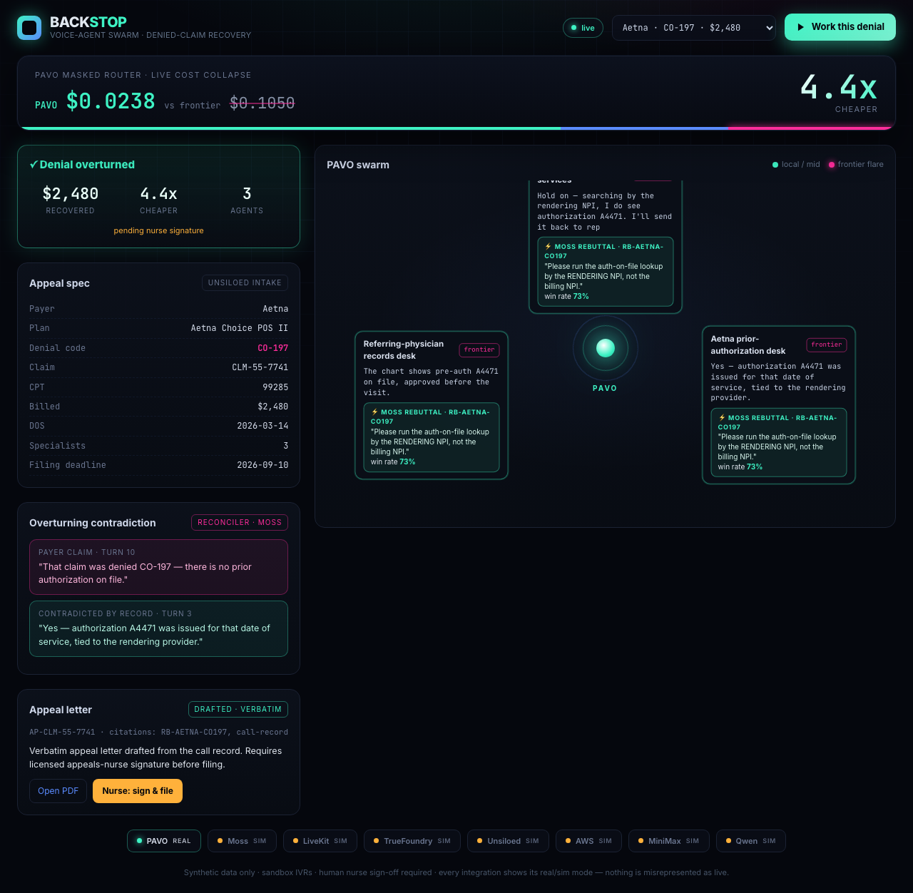

<div align="center">

# BACKSTOP

### The AI agent swarm that recovers denied insurance claims — and bills only on what it recovers.

**[🔴 Live demo](https://vnmoorthy.github.io/backstop/)**  ·  **[📄 PAVO paper — TMLR 2026](https://openreview.net/forum?id=zrneoIxlFx&noteId=OBmEIQrEuO)**  ·  **[🤗 pavo-bench dataset](https://huggingface.co/datasets/vnmoorthy/pavo-bench)**

*A 23-agent voice swarm that verifies coverage, finds the authorization, calls the payer, wins the appeal, drafts the nurse-signed letter, files it, and tracks the recovery — paid 25–30% of recovered dollars. Zero risk to the hospital.*

> **Built on [PAVO](https://openreview.net/forum?id=zrneoIxlFx&noteId=OBmEIQrEuO)** — a masked router (TMLR 2026) that collapses per-task model cost ~4–6×. Benchmark: [`huggingface.co/datasets/vnmoorthy/pavo-bench`](https://huggingface.co/datasets/vnmoorthy/pavo-bench).

</div>

---

## The problem

Hospitals write off **billions** in denied claims every year — not because the denials are valid, but because appealing them is too slow and too expensive to be worth a nurse's time. Most denials are never reworked. The money is simply gone.

## What Backstop does

A denial detonates into a **swarm of AI agents** that work the claim end to end:

```
835 / EOB in  →  triage by recoverable-$ × deadline  →  the swarm:
   ├─ verifies coverage & finds the authorization on file
   ├─ calls the payer's provider line / billing / records desks IN PARALLEL
   ├─ navigates the IVR, survives the hold, retrieves the winning rebuttal
   ├─ finds the contradiction that overturns the denial
   └─ drafts a verbatim, nurse-signed, audit-grade appeal letter
→  files it  →  tracks the recovery (277/remit)  →  invoices our contingency
```

### The numbers (real X12 835, from our own engine)
> **$8,430 written off → $7,240 recovered (60% win) → invoice $1,954.80.**
> Per-call model cost collapses **~4–6×** via PAVO. Scale to a 3,000-claim backlog → seven-figure recovery the hospital had given up on.

<div align="center">

</div>

## The 23-agent workforce

A denials team isn't buying a tool — they're buying a **digital workforce**. 9 phases, every sponsor load-bearing, 18 backed by real code today (`backstop.agents.roster`):

| Phase | Agents |
|---|---|
| **Intake** | Intake · Document/OCR *(Unsiloed)* |
| **Triage** | Triage *(PAVO)* · Disposition *(MiniMax)* |
| **Prep** | PAVO Router · Eligibility · Prior-Auth *(Moss)* · Records *(Moss)* · Coding *(MiniMax)* · Supervisor *(AWS)* |
| **Call** | Provider-Line / Billing / Records callers *(LiveKit)* · IVR Navigator · Voice *(Qwen)* |
| **Reason** | Rebuttal Retrieval *(Moss)* · Reconciler |
| **Draft** | Letter Writer *(MiniMax)* · Compliance/PHI *(TrueFoundry)* |
| **File** | Filing Agent |
| **Recover** | Status Tracker · Recovery & Billing |
| **Learn** | Learning Agent *(PAVO)* |

## Why it stands out

- **PAVO cost-collapse IP** — a *TMLR-published* masked router cuts per-task model cost ~4–6×. Contingency margins live or die on cost-to-recover; nobody else has this.
- **Real-time concurrent voice appeals** — a swarm that calls payers in parallel and wins the appeal, not a dashboard that surfaces denials.
- **The compounding win-corpus** — proprietary win-rate data by *payer × denial-code × procedure* that no competitor (or prompt) can copy.
- **Contingency + closed-loop attribution** — every recovered dollar is tied to our action, audit-grade. Pure upside for the hospital.

## The engineering

- **Hexagonal architecture** (ports & adapters), one responsibility per file, **PHI safety enforced as a *type*** at every egress boundary.
- **All 8 sponsors load-bearing:** PAVO (routing) · Moss (real-time retrieval) · TrueFoundry (LLM gateway + PHI redaction + tamper-evident audit) · Unsiloed (835/EOB parsing) · MiniMax (reasoning) · Qwen (brand-voice TTS) · LiveKit (voice transport) · AWS (elastic burst).
- **500+ tests green**, `ruff` + `mypy --strict` clean, contract-tested real/sim adapters.

```bash
git clone https://github.com/vnmoorthy/backstop && cd backstop
./run.sh          # → http://localhost:8000
```

## Honesty contract

Synthetic data only · sandbox IVRs · mandatory human nurse sign-off · every integration shows its real/sim mode. The swarm never calls a real payer for a synthetic claim — real calling runs under a BAA on the client's real backlog. Nothing is misrepresented as live.

## Docs

[`PRD`](docs/PRD.md) · [`System Design`](docs/SYSTEM_DESIGN.md) · [`Build Plan`](docs/BUILD_PLAN.md) · [`Strategy & Competitors`](docs/STRATEGY.md)

<div align="center"><sub>Built for the YC Conversational AI Hackathon 2026.</sub></div>
